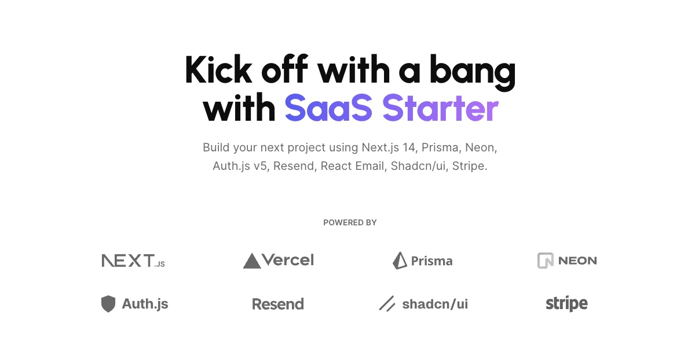

<a href="https://next-saas-stripe-starter.vercel.app">
  
  <h1 align="center">Get Cracked Starter SaaS Boilerplate</h1>
</a>

<p align="center">
  Accelerate Your SaaS Launch with a Premium, Pre-configured Foundation.
</p>

<p align="center">
  <a href="#introduction"><strong>Introduction</strong></a> ·
  <a href="#getting-started"><strong>Getting Started</strong></a> ·
  <a href="#whats-included"><strong>What's Included</strong></a> ·
  <a href="#author"><strong>Author</strong></a>
</p>
<br/>

## Introduction

Launch your next SaaS project with unparalleled speed and confidence using the Get Cracked Starter SaaS Boilerplate. This premium, production-ready codebase is meticulously engineered to save you thousands in developer costs and accelerate your time to market. Forget the tedious setup and boilerplate code – focus entirely on building your unique product and scaling your business.

Built with a modern and comprehensive tech stack, Get Cracked Starter integrates:
- **Next.js:** For a powerful, scalable, and performant frontend
- **Prisma & Neon:** For a reliable and efficient database layer
- **Clerk:** Secure and seamless authentication and user management
- **Stripe:** Integrated for subscriptions, payments, and robust billing
- **Resend & React Email:** Streamlined email delivery and templating
- **Shadcn/ui:** Beautifully designed and accessible UI components
- **AI Features (Business tier):** OpenRouter (GPT-4o, Deepseek R1) chat, Hume AI text-to-speech, content generation

Get Cracked Starter is designed for entrepreneurs, startups, and SaaS businesses ready to hit the ground running.

## Getting Started

To begin building your application with Get Cracked Starter, follow these steps:

1.  **Obtain the Boilerplate:** Purchase and download the Get Cracked Starter SaaS Boilerplate from [your_product_page_link_here].
2.  **Unpack and Install Dependencies:**

```bash
# Navigate to your project directory
cd get-cracked

# Install dependencies using pnpm:
pnpm install
```

3.  **Configure Environment Variables:** Copy `.env.example` to `.env.local` and update the variables with your specific API keys and credentials.

```sh
cp .env.example .env.local
```

4.  **Start the Development Server:**

```sh
pnpm run dev
```

## What's Included

### Pro Tier ($15/month):
- Complete production-ready SaaS codebase
- Authentication & user management (Clerk)
- Subscription & payment processing (Stripe)
- Database with Prisma ORM & Neon PostgreSQL
- Email system (Resend + React Email)
- Modern UI component library (Shadcn/ui)
- Blog & documentation system (MDX)
- Charts & analytics components
- Priority email support

### Business Tier ($30/month):
- Everything in Pro tier
- Preconfigured AI chat interface (GPT-4o, Deepseek R1)
- Text-to-Speech with Hume AI voices
- AI content generation system
- Web search integration for AI
- Advanced analytics dashboard
- 24/7 priority support
- Deployment assistance
